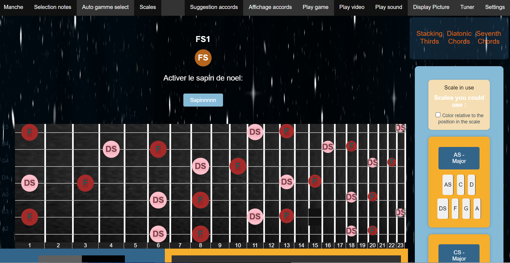

# Neck Wanker

## Warning, legacy code. If you want to build on it, considere refactor

This application has been designed to help me (and perhaps some other people) learning guitar.
It comes with multiple features : 
    - Video and audio player, with several parameters (speed, video and audio cropping...)
    - A tuner
    - A neck display that shows you the note that have already been played
    - A scale calculator that can help you knowing in which scale you re playing
    - A helper, giving you the different chords that fits in the scale
    - a picture loader in case of need
    - A small game to learn notes on the neck and intervals



## Project setup
```
npm install
```

### Compiles and hot-reloads for development
```
npm run electron:serve
```

### Compiles and minifies for production
```
npm run electron:build
```

### Lints and fixes files
```
npm run lint
```

### Customize configuration
See [Configuration Reference](https://cli.vuejs.org/config/).
